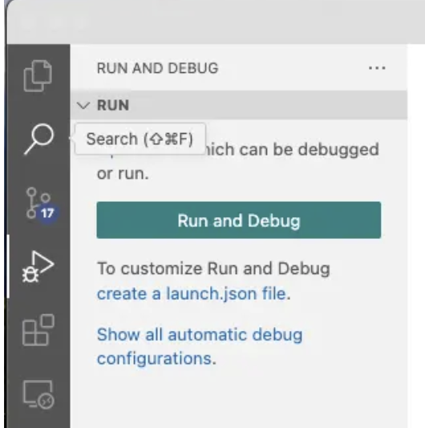

# Debug Django in VSCode

[Ref](https://medium.com/django-unleashed/debug-django-in-vscode-cd9759e82618)

เลือกเมนู "Run and Debug" ทางด้านซ้ายของ VS Code

จากนั้นเลือก "create a launch.json file" ใน panel ทางด้านซ้าย



VS Code จะทำการสร้างไฟล์ `launch.json` ขึ้นมาให้ ให้ใส่การตั้งค่าลงไปตามนี้

```json
{
    // Use IntelliSense to learn about possible attributes.
    // Hover to view descriptions of existing attributes.
    // For more information, visit: https://go.microsoft.com/fwlink/?linkid=830387
    "version": "0.2.0",
    "configurations": [

        {
            "name": "Python Debugger: Django",
            "type": "debugpy",
            "request": "launch",
            "args": [
                "runserver",
                "8080"
            ],
            "django": true,
            "autoStartBrowser": false,
            "python": "${workspaceFolder}/week11/myvenv/bin/python",
            "program": "${workspaceFolder}/week11/week11_tutorial/manage.py"
        }
    ]
}
```

จากนั้นกด "RUN" เพื่อทำการ runserver ขึ้นมาในโหมด DEBUG

# Installing Django Debug Toolbar

[Ref](https://django-debug-toolbar.readthedocs.io/en/latest/installation.html)

Django Debug Toolbar is a useful tool for debugging Django web applications. 

```bash
>>> pip install django-debug-toolbar
```

อย่าลืมเพิ่ม `` ใน INSTALLED_APPS

```python
INSTALLED_APPS = [
    # ...
    "debug_toolbar",
    # ...
]
```

จากนั้นไปเพิ่ม URLs สำหรับ django-debug-toolbar

```python
from django.urls import include, path
from debug_toolbar.toolbar import debug_toolbar_urls

urlpatterns = [
    # ... the rest of your URLconf goes here ...
] + debug_toolbar_urls()
```

เพิ่ม debug toolber ใน MIDDLEWARE

```python
MIDDLEWARE = [
    # ...
    "debug_toolbar.middleware.DebugToolbarMiddleware",
    # ...
]
```

Config internal IP

```python
INTERNAL_IPS = [
    # ...
    "127.0.0.1",
    # ...
]
```
