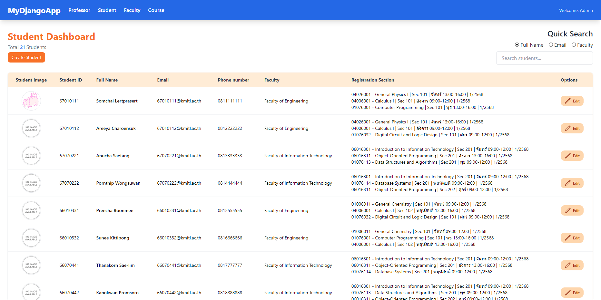
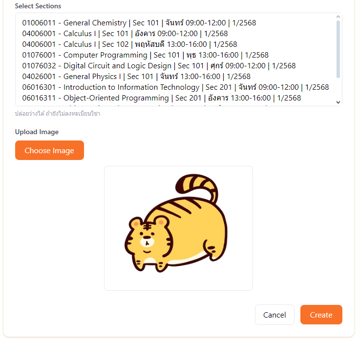
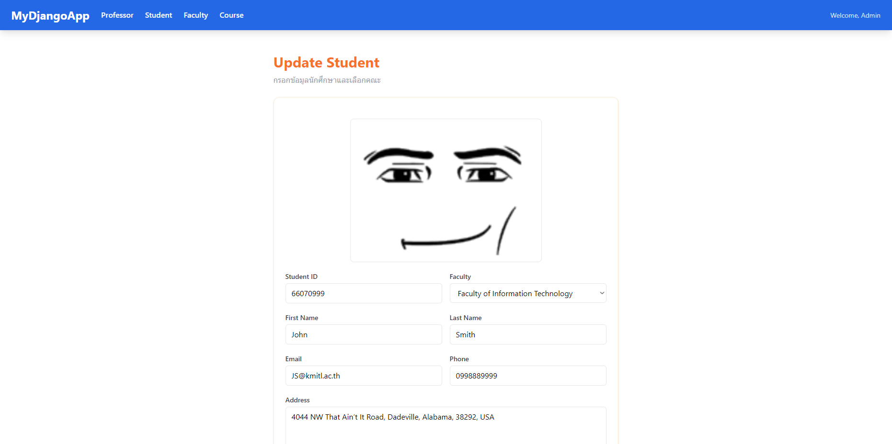

# WEEK 11 Exercise

- จะต้องใช้แบบฝึกหัดใน WEEK 10 ในการทำแบบฝึกหัดครั้งนี้ต่อครับ
- ไฟล์ template ที่เกี่ยวข้อง

```text
templates/
- index.html
- create_student.html
- update_student.html
```

## Part 1: File Field

1.1 ให้ทำการเพิ่ม field ใน model `StudentProfile` สำหรับข้อมูล `image` (ดังใน code ด้านล่าง) จากนั้นแก้ไข views, forms เพื่อสร้าง และแก้ไข student ให้บันทึกข้อมูลลงทั้งในตาราง `student` และ `studentprofile`

```python
class StudentProfile(models.Model):
    student = models.OneToOneField(Student, on_delete=models.CASCADE, primary_key=True)
    ...
    image = models.FileField(upload_to="image/", blank=True, null=True)
```

1.2 ในหน้าแสดงข้อมูลของ student ให้เพิ่มคอลัมสำหรับแสดงรูปภาพของ student ดังนี้ หาก student ไม่มีข้อมูล image ให้ทำการแสดงรูปภาพ `no-image.png` ที่อยู่ใน Folder static



1.3 ในหน้า `create_student` ให้แสดงช่องในการอัพโหลดรูป และเมื่ออัพโหลดรูปเข้าไปแสดง preview ของรูปด้วย เมื่อทำการสร้างสำเร็จให้กลับไปหน้าแสดงข้อมูล student



1.4 ในหน้า `update_student` หาก student ที่เลือกนั้นมีรูปอยู่แล้วให้ทำการแสดงรูปของ student ด้วย และเมื่ออัพโหลดรูปเข้าไป ให้ทำการอัพเดททับรูปเก่า เมื่อทำการอัพเดทข้อมูลสำเร็จให้กลับไปหน้าแสดงข้อมูล student



---

## Part 2: Transaction

ใน Part 2 เราจะมาลองใช้งาน **Transaction** ของ Django เพื่อให้การสร้างและอัพเดท Student/StudentProfile เกิดขึ้นเป็น atomic operation คือ **สำเร็จทั้งคู่ หรือ rollback ทั้งคู่**

### 2.1 การสร้าง Student พร้อม StudentProfile

- ให้แก้ไข `StudentCreate` view
- ใช้ `transaction.atomic()` ครอบการทำงานของ `student.save()` และ `studentprofile.save()`
- ถ้า `StudentProfileForm` ไม่ valid → ให้ rollback อัตโนมัติ และไม่บันทึก Student ลงฐานข้อมูล

**Hint:**

```python
form1 = Form1(request.POST)
form2 = Form2(request.POST, request.FILES)
try:
    with transaction.atomic():
        if form1.is_valid():
            form1_object = form1.save()
            form2 = Form2(
                data={**request.POST.dict(), "form1_object": form1_object},
                files=request.FILES
            )
            if form2.is_valid():
                form2.save()
        else:
            raise transaction.TransactionManagementError("Error")
except Exception:
```

---

**ผลลัพธ์ที่คาดหวัง**

- ถ้า form ทั้งคู่ valid → ข้อมูลถูกบันทึกทั้ง Student และ StudentProfile
- ถ้ามี error form ใด form หนึ่ง → ไม่มีข้อมูลถูกบันทึก (rollback)
- กลับไปหน้าแสดงรายชื่อนักเรียนทั้งหมด หลังบันทึกสำเร็จ
